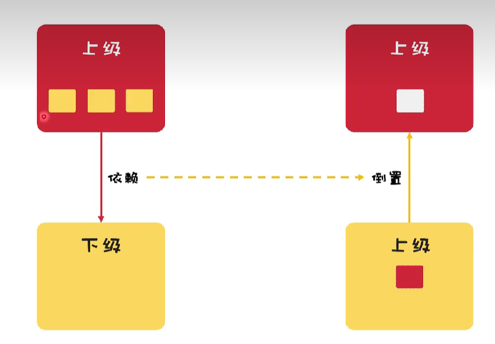

# 设计模式六大原则
## 1. 单一职责原则
* 原则定义: 一个类应该只有一个发生变化的原因
* 模拟场景: 访客用户·普通用户·VIP用户
* 编码实现: ifelse·判断实现·不易维护
```text
单一职责原则(SRP：Single responsibility principle)又称单一功能原则，面向对象五个基本原则（SOLID）之一。
```

## 2.开闭原则
* 开闭原则: 扩展开放,修改封闭
* 面积计算: 长方形·三角形·圆形
* 编码实现: 破坏方法·继承扩展
```text
开闭原则规定(Open/Closed principle)"软件中的对象(类,模块,函数等等)应该对于扩展是开放的,但是对于修改是封闭的"。
```

## 3.里式替换原则
* 里式替换原则: 扩展开放,修改封闭
* 银行卡: 信用卡、储蓄卡、地铁卡、饭卡
* 编码实现: 银行卡类、正向、逆向
```text
里式替换原则(Liskov Substitution Principle) 继承必须确保超类所拥有的性质在子类中依然成立。
即:子类继承父类时，除添加新的方法完成新增功能外，尽量不要重写父类的方法。
```

## 4.迪米特法则原则
* 迪米特法则: 最少知道、减少依赖
* 学生成绩&排名: 校长、教师、学生、成绩、排名
* 编码实现：高内聚、低耦合
```text
迪米特原则(Law of Demeter,LOD),又叫作最少知识原则（The Least Knowledge Principle）:意义在于降低类之间的耦合。由于每个对象尽量减少对其他对象的了解，因此，很容易使得系统的
功能模块功能独立，相互之间不存在（或很少有）依赖关系。 
```

## 5.接口隔离原则
* 接口隔离原则: 更小的接口、更具体的接口
* 王者荣耀：射箭、隐袭、沉默、眩晕
* 编码实现：高内聚、低耦合
```text
接口隔离原则(Interface Segregation Principle, ISP)：要求程序员尽量将臃肿庞大的接口拆分为更小的和更具体的接口,让接口中只包含
客户感兴趣的方法。
```

## 6.依赖倒置原则

* 依赖倒置原则: 依赖接口、降低耦合
* 用户抽奖：随机抽奖、权重抽奖
* 编码实现：高内聚、低耦合
```text
依赖倒置原则(DIP,Dependency Inversion Principle):程序要依赖于抽象接口，而不要依赖于具体实现。简单的说就是要求对抽象进行编程,
不要对实现进行编程,这样就降低了客户与实现模块间的耦合。
模块间的依赖通过抽象发生，实现类之间不发生直接的依赖关系，其依赖关系是通过接口或者抽象类产生的；
接口或抽象类不依赖于实现类；
实现类依赖接口或抽象类
```